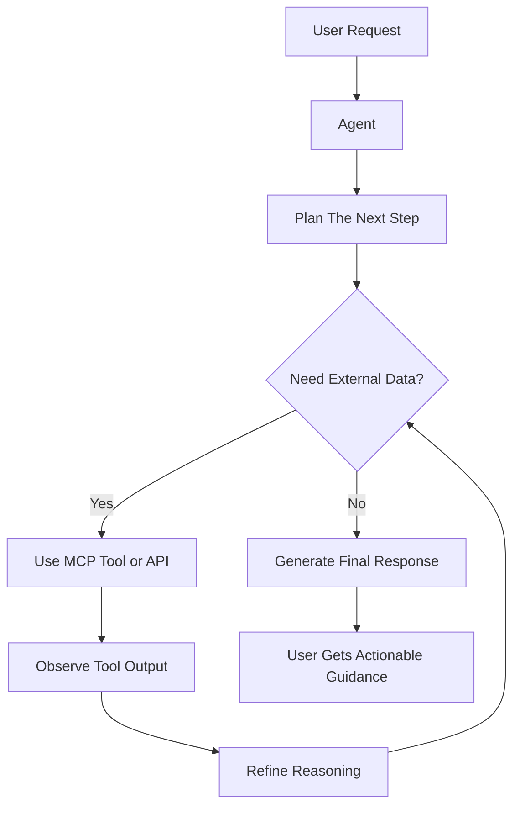

# 3. Microsoft Agent Framework Agents

- [3. Microsoft Agent Framework Agents](#3-microsoft-agent-framework-agents)
  - [Module Goals](#module-goals)
  - [In This Module](#in-this-module)
  - [What Is Microsoft Agent Framework?](#what-is-microsoft-agent-framework)
  - [Agent Execution Flow](#agent-execution-flow)
  - [Step 1 - Create the Test Script](#step-1---create-the-test-script)
  - [Step 2 - Add the Agent Code](#step-2---add-the-agent-code)
  - [Step 3 - Run the Script](#step-3---run-the-script)
  - [Expected Outcomes](#expected-outcomes)
  - [Notes On OpsAgent Design](#notes-on-opsagent-design)
  - [Next](#next)

In this module, we will build our first AI agent using the Microsoft Agent Framework and GitHub Models.

Before integrating Chainlit or building a web UI, we will first understand how agents work directly from the command line (CLI). This helps you focus on core concepts such as prompts, models, streaming, and conversation flow without additional UI complexity.

## Module Goals

By the end of this module, you will be able to:

- Define an agent with instructions and model configuration
- Organize agent code for better maintainability
- Run and validate agent responses locally

## In This Module

- Create an initial agent setup
- Configure system instructions and model settings
- Run the agent locally
- Validate conversation behavior and memory handling

## What Is Microsoft Agent Framework?

The Microsoft Agent Framework is an open-source framework for building AI-powered agents capable of:

- Thinking through tasks
- Acting using tools and APIs
- Observing results
- Repeating the process until completion

At its core, an agent combines:

- A language model
- Instructions
- Conversation state and memory
- Tools and actions

## Agent Execution Flow



## Step 1 - Create the Test Script

Inside [lab/test_microsoft_agent_framework.py](../../lab/test_microsoft_agent_framework.py), add the test script for this module.

```bash
touch test_microsoft_agent_framework.py
```

## Step 2 - Add the Agent Code

Use the following code:

```python
"""
Module 3 - Test Microsoft Agent Framework Agent

Run:
    python test_microsoft_agent_framework.py
    or
    uv run test_microsoft_agent_framework.py
"""

import asyncio
import os

from dotenv import load_dotenv
from openai import AsyncOpenAI

from agent_framework import Agent
from agent_framework.openai import OpenAIChatCompletionClient

load_dotenv()

github_base_url = "https://models.github.ai/inference"
GITHUB_TOKEN = os.getenv("GITHUB_TOKEN")
GITHUB_MODEL = os.getenv("GITHUB_MODEL")

if not GITHUB_TOKEN or not GITHUB_MODEL:
    raise ValueError("GITHUB_TOKEN and GITHUB_MODEL must be set in the .env file")


async def run_agent_non_streaming(agent: Agent, query: str):
    """Run the agent in non-streaming mode."""
    print("🧪 Running non-streaming test...")
    result = await agent.run(query)
    print(f"💬 OpsAgent: {result}")
    print("\n✅ Non-streaming test complete\n")


async def run_agent_streaming(agent: Agent, query: str):
    """Run the agent in streaming mode."""
    print("🧪 Running streaming test...")
    print("💬 OpsAgent: ", end="", flush=True)

    async for chunk in agent.run(query, stream=True):
        if chunk.text:
            print(chunk.text, end="", flush=True)

    print("\n✅ Streaming test complete\n")


async def main():
    """Create and run OpsAgent with GitHub Models."""

    print("🤖 Initializing OpsAgent...")

    async_openai = AsyncOpenAI(
        api_key=GITHUB_TOKEN,
        base_url=github_base_url,
    )

    client = OpenAIChatCompletionClient(
        model=GITHUB_MODEL,
        async_client=async_openai,
    )

    agent = Agent(
        client=client,
        name="OpsAgent",
        description="OpsAgent is an AI-powered operations and engineering assistant.",
        instructions="""
        You are OpsAgent, an AI-powered operations and engineering assistant.
        Help developers and cloud engineers troubleshoot issues,
        retrieve documentation, analyze systems, and automate operational workflows.
        Keep responses concise, actionable, and practical.
        """,
    )

    await run_agent_non_streaming(agent, "How do I deploy a container app in Azure?")

    # Wait a moment before starting the streaming test to ensure clear separation in the output
    print("⏳ Waiting 5 seconds before starting streaming test...\n")
    await asyncio.sleep(5)

    await run_agent_streaming(agent, "How do I deploy a container app in Azure?")


if __name__ == "__main__":
    asyncio.run(main())
```

## Step 3 - Run the Script

```bash
python test_microsoft_agent_framework.py
# or
uv run test_microsoft_agent_framework.py
```

## Expected Outcomes

- The agent initializes using GitHub Models
- A non-streaming response is returned and labeled complete
- A 5-second pause separates the two test runs
- A streaming response appears token-by-token in real time
- Each test section is independently labeled and confirmed complete

## Notes On OpsAgent Design

This module uses the OpsAgent identity from the workshop overview:

- Focused on operations and engineering scenarios
- Useful for documentation retrieval and troubleshooting workflows
- Designed for concise and actionable guidance

## Next

Continue to [4. Tool Calling](./4-tool-calling).
