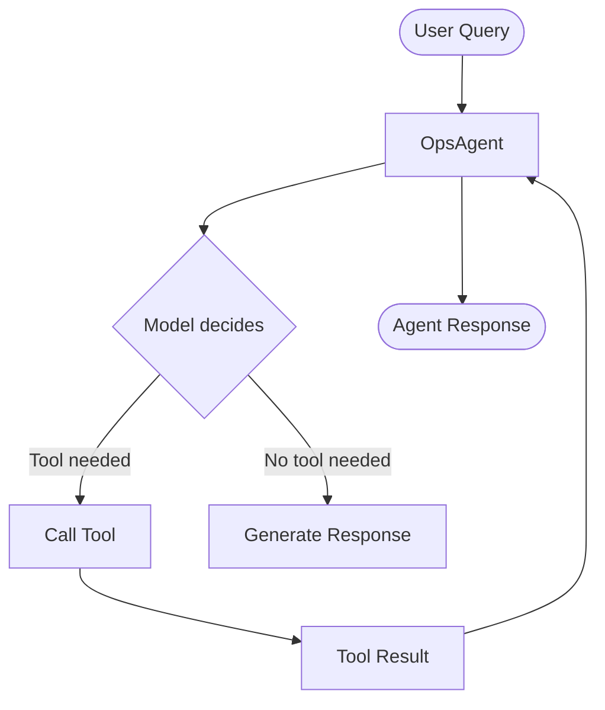

# 4. Tool Calling

In this module, we extend OpsAgent with callable tools so it can take real actions — like checking service health, generating deployment checklists, or diagnosing errors — instead of relying solely on model knowledge.

## Module Goals

By the end of this module, you will be able to:

- Understand the `@tool` decorator pattern from Microsoft Agent Framework
- Define OpsAgent-specific tools with typed parameters and docstrings
- Register tools with the agent and validate end-to-end tool execution

## In This Module

- What Is Tool Calling
- Tool Calling Flow
- How to Use the `@tool` Decorator
- OpsAgent Tools
- Step 1 through Step 5
- Expected Outcomes

## What Is Tool Calling

Tool calling allows an agent to invoke custom Python functions during a conversation. When the model determines a tool is relevant, it calls the function, receives the result, and incorporates it into its response.

Tools are ideal for:

- Querying live systems (APIs, databases, service health)
- Running deterministic logic the model should not guess at
- Returning structured data the agent uses to form a grounded answer

## Tool Calling Flow



## How to Use the `@tool` Decorator

Use the `@tool` decorator from `agent_framework`. Annotate each parameter with `Annotated` and `Field` so the model understands what to supply. The function's docstring is used as the tool description.

```python
from typing import Annotated
from pydantic import Field
from agent_framework import tool

# NOTE: approval_mode="never_require" is for sample brevity.
# Use "always_require" in production for user confirmation before tool execution.
@tool(approval_mode="never_require")
def get_service_status(
    service: Annotated[str, Field(description="The name of the service to check.")],
) -> str:
    """Get the current status of a service."""
    return f"{service} is running normally."
```

Pass the tool to the agent via `tools=[...]`:

```python
agent = Agent(
    client=client,
    name="OpsAgent",
    instructions="You are an operations assistant. Use the get_service_status tool to answer questions.",
    tools=[get_service_status],
)
```

> Source: [Microsoft Learn — Add Tools](https://learn.microsoft.com/agent-framework/get-started/add-tools)

## OpsAgent Tools

This module adds three tools tailored to OpsAgent's operations and engineering focus:

| Tool | Purpose |
| --- | --- |
| `check_azure_service_health` | Returns simulated health status of an Azure service in a given region |
| `get_deployment_checklist` | Returns a step-by-step deployment checklist for a given Azure service type |
| `diagnose_error` | Returns troubleshooting guidance for common HTTP or Azure error codes |

## Step 1 - Create the Test Script

Inside [lab/test_tool_calling.py](../../lab/test_tool_calling.py), add the test script for this module.

```bash
touch test_tool_calling.py
```

## Step 2 - Define the OpsAgent Tools

Define the tools first, separately from agent setup. Each tool uses the `@tool` decorator, typed parameters, and a docstring so the model knows when and how to call it.

```python
import random
from datetime import datetime, timezone
from typing import Annotated

from pydantic import Field

from agent_framework import tool


# NOTE: approval_mode="never_require" is for sample brevity.
# Use "always_require" in production for user confirmation before tool execution.

@tool(approval_mode="never_require")
def check_azure_service_health(
    service: Annotated[str, Field(description="The Azure service name to check, e.g. 'App Service', 'AKS', 'Cosmos DB'.")],
    region: Annotated[str, Field(description="Azure region, e.g. 'East US', 'West Europe'.")] = "East US",
) -> str:
    """Check the health status of an Azure service in a given region."""
    statuses = ["Healthy", "Degraded", "Under investigation"]
    weights = [0.8, 0.15, 0.05]
    status = random.choices(statuses, weights=weights)[0]
    timestamp = datetime.now(timezone.utc).strftime("%Y-%m-%d %H:%M UTC")
    return f"Azure {service} in {region}: {status}. Last checked: {timestamp}"


@tool(approval_mode="never_require")
def get_deployment_checklist(
    service_type: Annotated[str, Field(description="Azure service type, e.g. 'Container App', 'AKS', 'App Service', 'Function App'.")],
) -> str:
    """Return a deployment readiness checklist for the given Azure service type."""
    checklists: dict[str, list[str]] = {
        "container app": [
            "Confirm container image is pushed to ACR",
            "Set AZURE_RESOURCE_GROUP and AZURE_LOCATION environment variables",
            "Run: az containerapp up --name <app> --image <registry>/<image>:<tag>",
            "Configure ingress (external/internal) and target port",
            "Check replica count and autoscaling rules",
        ],
        "aks": [
            "Ensure kubectl is configured: az aks get-credentials --resource-group <rg> --name <cluster>",
            "Validate Helm chart or manifests with: kubectl apply --dry-run=client -f <file>",
            "Check node pool capacity and resource quotas",
            "Confirm image pull secrets for private registry",
            "Apply RBAC and network policies before deployment",
        ],
        "app service": [
            "Verify App Service plan tier meets workload requirements",
            "Set app settings and connection strings via: az webapp config appsettings set",
            "Enable deployment slot for zero-downtime swap",
            "Configure health check endpoint under Settings > Health check",
            "Deploy using: az webapp deploy or a GitHub Actions workflow",
        ],
        "function app": [
            "Set storage account connection string (AzureWebJobsStorage)",
            "Choose Consumption, Premium, or Dedicated hosting plan",
            "Configure FUNCTIONS_WORKER_RUNTIME to match your language runtime",
            "Deploy with: func azure functionapp publish <app-name>",
            "Enable Application Insights for monitoring and alerting",
        ],
    }
    key = service_type.lower()
    for k, items in checklists.items():
        if k in key:
            checklist = "\n".join(f"  - {item}" for item in items)
            return f"Deployment checklist for {service_type}:\n{checklist}"
    return (
        f"Generic checklist for {service_type}:\n"
        "  - Review the official Azure documentation for this service\n"
        "  - Validate resource quotas in your subscription\n"
        "  - Configure monitoring and alerts before going live\n"
        "  - Test the deployment in a staging environment first"
    )


@tool(approval_mode="never_require")
def diagnose_error(
    error_code: Annotated[str, Field(description="HTTP status code or Azure error code, e.g. '429', '503', 'ResourceNotFound'.")],
    service: Annotated[str, Field(description="The Azure service or component where the error occurred.")] = "unknown",
) -> str:
    """Diagnose a common error code and return actionable troubleshooting guidance."""
    diagnoses: dict[str, tuple[str, list[str]]] = {
        "429": (
            "Too Many Requests / Throttling",
            [
                "Implement exponential backoff with jitter in your retry logic.",
                "Check the Retry-After response header for the required wait duration.",
                "Review your service tier and consider requesting a quota increase.",
                "For Cosmos DB: monitor RU consumption and scale up provisioned throughput.",
            ],
        ),
        "503": (
            "Service Unavailable",
            [
                "The service may be temporarily overloaded or under maintenance.",
                "Check the Azure Service Health dashboard for active incidents.",
                "Verify health check probes are not timing out prematurely.",
                "Retry with exponential backoff; activate a failover region if configured.",
            ],
        ),
        "resourcenotfound": (
            "Resource Not Found",
            [
                "Confirm the resource name, resource group, and subscription ID are correct.",
                "Ensure the resource has not been deleted or moved to another group.",
                "Check RBAC permissions — you may lack read access to the resource.",
                "Verify the correct Azure region is targeted in your request.",
            ],
        ),
        "403": (
            "Forbidden / Authorization Failure",
            [
                "Verify the managed identity or service principal has the required RBAC roles.",
                "Check that no resource policy or deny assignment is blocking the operation.",
                "Ensure the request includes a valid and non-expired Bearer token.",
            ],
        ),
        "timeout": (
            "Request Timeout",
            [
                "Increase the client-side timeout setting in your SDK or HTTP client.",
                "Check the network path: VNet peering, NSG rules, and private endpoints.",
                "Review CPU and memory pressure on the target service.",
            ],
        ),
    }
    key = error_code.lower().replace(" ", "")
    for k, (title, steps) in diagnoses.items():
        if k in key:
            guidance = "\n".join(f"  {i + 1}. {s}" for i, s in enumerate(steps))
            return f"[{error_code}] {title} on {service}:\n{guidance}"
    return (
        f"No specific guidance found for error '{error_code}' on {service}. "
        "Recommended next steps: check Azure Service Health, review Application Insights logs, "
        "and consult the official Azure documentation for this service."
    )
```

## Step 3 - Register Tools in the Agent

Add the tools at the `tools=[...]` location in the `Agent(...)` block. This is the exact place where tool registration happens.

```python
agent = Agent(
    client=client,
    name="OpsAgent",
    description="OpsAgent is an AI-powered operations and engineering assistant.",
    instructions="""
    You are OpsAgent, an AI-powered operations and engineering assistant.
    Help developers and cloud engineers troubleshoot issues,
    retrieve documentation, analyze systems, and automate operational workflows.
    Use the available tools when relevant. Keep responses concise, actionable, and practical.
    """,
    tools=[
        check_azure_service_health,
        get_deployment_checklist,
        diagnose_error,
    ],
)
```

## Step 4 - Complete Code (Single File)

Now combine imports, environment setup, tool definitions, tool registration, and a single-query run into one file.

```python
"""
Module 4 - Test Tool Calling with OpsAgent

Run:
    python test_tool_calling.py
    or
    uv run test_tool_calling.py
"""

import asyncio
import os
import random
from datetime import datetime, timezone
from typing import Annotated

from dotenv import load_dotenv
from openai import AsyncOpenAI
from pydantic import Field

from agent_framework import Agent, tool
from agent_framework.openai import OpenAIChatCompletionClient

load_dotenv()

github_base_url = "https://models.github.ai/inference"
GITHUB_TOKEN = os.getenv("GITHUB_TOKEN")
GITHUB_MODEL = os.getenv("GITHUB_MODEL")

if not GITHUB_TOKEN or not GITHUB_MODEL:
    raise ValueError("GITHUB_TOKEN and GITHUB_MODEL must be set in the .env file")


# NOTE: approval_mode="never_require" is for sample brevity.
# Use "always_require" in production for user confirmation before tool execution.


@tool(approval_mode="never_require")
def check_azure_service_health(
    service: Annotated[
        str,
        Field(
            description="The Azure service name to check, e.g. 'App Service', 'AKS', 'Cosmos DB'."
        ),
    ],
    region: Annotated[
        str,
        Field(description="Azure region, e.g. 'East US', 'West Europe'."),
    ] = "East US",
) -> str:
    """Check the health status of an Azure service in a given region."""
    statuses = ["Healthy", "Degraded", "Under investigation"]
    weights = [0.8, 0.15, 0.05]
    status = random.choices(statuses, weights=weights)[0]
    timestamp = datetime.now(timezone.utc).strftime("%Y-%m-%d %H:%M UTC")
    return f"Azure {service} in {region}: {status}. Last checked: {timestamp}"


@tool(approval_mode="never_require")
def get_deployment_checklist(
    service_type: Annotated[
        str,
        Field(
            description="Azure service type, e.g. 'Container App', 'AKS', 'App Service', 'Function App'."
        ),
    ],
) -> str:
    """Return a deployment readiness checklist for the given Azure service type."""
    checklists: dict[str, list[str]] = {
        "container app": [
            "Confirm container image is pushed to ACR",
            "Set AZURE_RESOURCE_GROUP and AZURE_LOCATION environment variables",
            "Run: az containerapp up --name <app> --image <registry>/<image>:<tag>",
            "Configure ingress (external/internal) and target port",
            "Check replica count and autoscaling rules",
        ],
        "aks": [
            "Ensure kubectl is configured: az aks get-credentials --resource-group <rg> --name <cluster>",
            "Validate Helm chart or manifests with: kubectl apply --dry-run=client -f <file>",
            "Check node pool capacity and resource quotas",
            "Confirm image pull secrets for private registry",
            "Apply RBAC and network policies before deployment",
        ],
        "app service": [
            "Verify App Service plan tier meets workload requirements",
            "Set app settings and connection strings via: az webapp config appsettings set",
            "Enable deployment slot for zero-downtime swap",
            "Configure health check endpoint under Settings > Health check",
            "Deploy using: az webapp deploy or a GitHub Actions workflow",
        ],
        "function app": [
            "Set storage account connection string (AzureWebJobsStorage)",
            "Choose Consumption, Premium, or Dedicated hosting plan",
            "Configure FUNCTIONS_WORKER_RUNTIME to match your language runtime",
            "Deploy with: func azure functionapp publish <app-name>",
            "Enable Application Insights for monitoring and alerting",
        ],
    }
    key = service_type.lower()
    for k, items in checklists.items():
        if k in key:
            checklist = "\n".join(f"  - {item}" for item in items)
            return f"Deployment checklist for {service_type}:\n{checklist}"
    return (
        f"Generic checklist for {service_type}:\n"
        "  - Review the official Azure documentation for this service\n"
        "  - Validate resource quotas in your subscription\n"
        "  - Configure monitoring and alerts before going live\n"
        "  - Test the deployment in a staging environment first"
    )


@tool(approval_mode="never_require")
def diagnose_error(
    error_code: Annotated[
        str,
        Field(
            description="HTTP status code or Azure error code, e.g. '429', '503', 'ResourceNotFound'."
        ),
    ],
    service: Annotated[
        str,
        Field(description="The Azure service or component where the error occurred."),
    ] = "unknown",
) -> str:
    """Diagnose a common error code and return actionable troubleshooting guidance."""
    diagnoses: dict[str, tuple[str, list[str]]] = {
        "429": (
            "Too Many Requests / Throttling",
            [
                "Implement exponential backoff with jitter in your retry logic.",
                "Check the Retry-After response header for the required wait duration.",
                "Review your service tier and consider requesting a quota increase.",
                "For Cosmos DB: monitor RU consumption and scale up provisioned throughput.",
            ],
        ),
        "503": (
            "Service Unavailable",
            [
                "The service may be temporarily overloaded or under maintenance.",
                "Check the Azure Service Health dashboard for active incidents.",
                "Verify health check probes are not timing out prematurely.",
                "Retry with exponential backoff; activate a failover region if configured.",
            ],
        ),
        "resourcenotfound": (
            "Resource Not Found",
            [
                "Confirm the resource name, resource group, and subscription ID are correct.",
                "Ensure the resource has not been deleted or moved to another group.",
                "Check RBAC permissions — you may lack read access to the resource.",
                "Verify the correct Azure region is targeted in your request.",
            ],
        ),
        "403": (
            "Forbidden / Authorization Failure",
            [
                "Verify the managed identity or service principal has the required RBAC roles.",
                "Check that no resource policy or deny assignment is blocking the operation.",
                "Ensure the request includes a valid and non-expired Bearer token.",
            ],
        ),
        "timeout": (
            "Request Timeout",
            [
                "Increase the client-side timeout setting in your SDK or HTTP client.",
                "Check the network path: VNet peering, NSG rules, and private endpoints.",
                "Review CPU and memory pressure on the target service.",
            ],
        ),
    }
    key = error_code.lower().replace(" ", "")
    for k, (title, steps) in diagnoses.items():
        if k in key:
            guidance = "\n".join(f"  {i + 1}. {s}" for i, s in enumerate(steps))
            return f"[{error_code}] {title} on {service}:\n{guidance}"
    return (
        f"No specific guidance found for error '{error_code}' on {service}. "
        "Recommended next steps: check Azure Service Health, review Application Insights logs, "
        "and consult the official Azure documentation for this service."
    )


async def main():
    """Create and run OpsAgent for one user query."""

    print("🤖 OpsAgent is ready for one question.\n")

    async_openai = AsyncOpenAI(
        api_key=GITHUB_TOKEN,
        base_url=github_base_url,
    )

    client = OpenAIChatCompletionClient(
        model=GITHUB_MODEL,
        async_client=async_openai,
    )

    agent = Agent(
        client=client,
        name="OpsAgent",
        description="OpsAgent is an AI-powered operations and engineering assistant.",
        instructions="""
        You are OpsAgent, an AI-powered operations and engineering assistant.
        Help developers and cloud engineers troubleshoot issues,
        retrieve documentation, analyze systems, and automate operational workflows.
        Use the available tools when relevant. Keep responses concise, actionable, and practical.
        """,
        tools=[check_azure_service_health, get_deployment_checklist, diagnose_error],
    )

    try:
        query = input("👤 You: ").strip()
    except (EOFError, KeyboardInterrupt):
        print("\n👋 Goodbye!")
        return

    if not query:
        print("No query provided. Exiting.")
        return

    result = await agent.run(query)
    print(f"\n💬 OpsAgent: {result.text}\n")


if __name__ == "__main__":
    asyncio.run(main())
```

## Step 5 - Run the Script

```bash
python test_tool_calling.py
# or
uv run test_tool_calling.py
```

### Example Output

```text
🤖 OpsAgent is ready for one question.

👤 You: I'm getting a 429 error on Cosmos DB. How do I fix it?
💬 OpsAgent: [429] Too Many Requests / Throttling on Cosmos DB:
  1. Implement exponential backoff with jitter in your retry logic.
  2. Check the Retry-After response header for the required wait duration.
  3. Review your service tier and consider requesting a quota increase.
  4. For Cosmos DB: monitor RU consumption and scale up provisioned throughput.
```

## Expected Outcomes

- OpsAgent reads one user query and runs once
- The agent calls relevant tools when needed and returns one grounded response
- The script exits after printing the response

## Notes On Tool Design

- **`@tool` decorator**: Registers the function with the agent runtime and exposes its schema to the model
- **`Annotated` + `Field(description=...)`**: Gives the model context to select and invoke the right tool
- **Docstring**: Used as the tool's description in the model's tool selection logic
- **`approval_mode="never_require"`**: Tool executes immediately — use `"always_require"` in production for user confirmation before tool execution

## Next

Continue to [5. MCP Integration](./5-mcp-integration.md).
