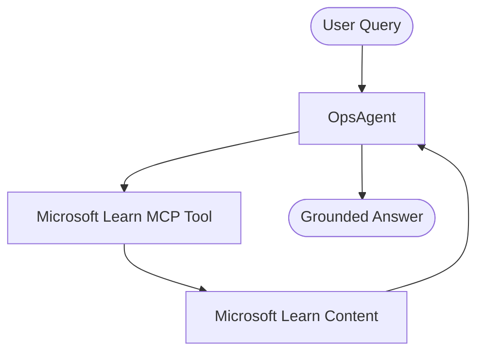

# 5. MCP Integration

In this module, you connect OpsAgent to a hosted Model Context Protocol (MCP) server from Microsoft Learn so the agent can answer questions with up-to-date documentation context.

## Module Goals

By the end of this module, you will be able to:

- Understand how hosted MCP tools work with Microsoft Agent Framework
- Create an OpsAgent that uses only an MCP tool (no local function tools)
- Run one user query and return one grounded answer from MCP-backed retrieval

## In This Module

- What Is MCP Integration
- Step 1 through Step 5
- Expected Outcomes

## What Is MCP Integration

MCP integration lets an agent call tools exposed by a remote MCP server endpoint. In this module, the MCP server is hosted by Microsoft Learn at `https://learn.microsoft.com/api/mcp`.

With MCP Integration:

- The agent can query external knowledge through the MCP tool
- You can connect generic tools from standard MCP servers securely
- The framework manages execution and parsing seamlessly

## MCP Flow



## Step 1 - Create the Test Script

Inside [lab/test_mcp_integration.py](../../lab/test_mcp_integration.py), add the script for this module.

```bash
touch test_mcp_integration.py
```

## Step 2 - Ensure GitHub Environment Variables

Make sure you have your GitHub connection values in `.env` (carried over from the previous modules):

```env
GITHUB_TOKEN=github_pat_...
GITHUB_MODEL=gpt-4o-mini
```

## Step 3 - Create the MCP Tool (MCP Only)

Create the `MCPStreamableHTTPTool` for Microsoft Learn content.

```python
from agent_framework import MCPStreamableHTTPTool

# MCP-only setup: no local Python function tools are added.
learn_mcp = MCPStreamableHTTPTool(
    name="Microsoft Learn MCP",
    url="https://learn.microsoft.com/api/mcp",
    approval_mode="never_require",
)
```

## Step 4 - Register MCP Tool and Run One Query

As before, register the MCP tool in `Agent(tools=[...])`. The setup of the `AsyncOpenAI` client uses the GitHub Models endpoint just like in Module 4.

```python
async with Agent(
    client=client,
    name="OpsAgent",
    description="OpsAgent is an AI-powered operations and engineering assistant.",
    instructions=(
        "You are OpsAgent, an AI-powered operations and engineering assistant. "
        "Answer using Microsoft Learn MCP results only, with concise, actionable guidance for cloud operations."
    ),
    tools=[learn_mcp],
) as agent:
    result = await agent.run(query)
    print(f"\n💬 OpsAgent: {result.text}\n")
```

## Step 5 - Complete Code (Single File)

```python
"""
Module 5 - Test MCP Integration with OpsAgent

Run:
    python test_mcp_integration.py
    or
    uv run test_mcp_integration.py
"""

import asyncio
import os

from dotenv import load_dotenv
from openai import AsyncOpenAI

from agent_framework import Agent, MCPStreamableHTTPTool
from agent_framework.openai import OpenAIChatCompletionClient

load_dotenv()

github_base_url = "https://models.github.ai/inference"
GITHUB_TOKEN = os.getenv("GITHUB_TOKEN")
GITHUB_MODEL = os.getenv("GITHUB_MODEL")

if not GITHUB_TOKEN or not GITHUB_MODEL:
    raise ValueError("GITHUB_TOKEN and GITHUB_MODEL must be set in the .env file")


async def main():
    """Create and run OpsAgent with a hosted Microsoft Learn MCP tool."""

    print("🤖 OpsAgent (MCP) is ready for one question.\n")

    try:
        query = input("👤 You: ").strip()
    except (EOFError, KeyboardInterrupt):
        print("\n👋 Goodbye!")
        return

    if not query:
        print("No query provided. Exiting.")
        return

    async_openai = AsyncOpenAI(
        api_key=GITHUB_TOKEN,
        base_url=github_base_url,
    )

    client = OpenAIChatCompletionClient(
        model=GITHUB_MODEL,
        async_client=async_openai,
    )

    # MCP-only setup: no local Python function tools are added.
    learn_mcp = MCPStreamableHTTPTool(
        name="Microsoft Learn MCP",
        url="https://learn.microsoft.com/api/mcp",
        approval_mode="never_require",
    )

    async with Agent(
        client=client,
        name="OpsAgent",
        description="OpsAgent is an AI-powered operations and engineering assistant.",
        instructions=(
            "You are OpsAgent, an AI-powered operations and engineering assistant. "
            "Answer using Microsoft Learn MCP results only, with concise, actionable guidance for cloud operations."
        ),
        tools=[learn_mcp],
    ) as agent:
        result = await agent.run(query)
        print(f"\n💬 OpsAgent: {result.text}\n")


if __name__ == "__main__":
    asyncio.run(main())
```

### Run the Script

```bash
python test_mcp_integration.py
# or
uv run test_mcp_integration.py
```

### Example Output

```text
🤖 OpsAgent (MCP) is ready for one question.

👤 You: What is Azure App Service?

💬 OpsAgent: Azure App Service is a fully managed Platform as a Service (PaaS) that enables users to build, deploy, and scale web apps, mobile app back ends, and RESTful APIs without needing to manage the underlying infrastructure...
```

## Expected Outcomes

- OpsAgent initializes with GitHub Models credentials
- The agent uses only one MCP tool: Microsoft Learn MCP
- A single user query is processed and answered once
- The response is grounded by MCP-backed documentation retrieval
